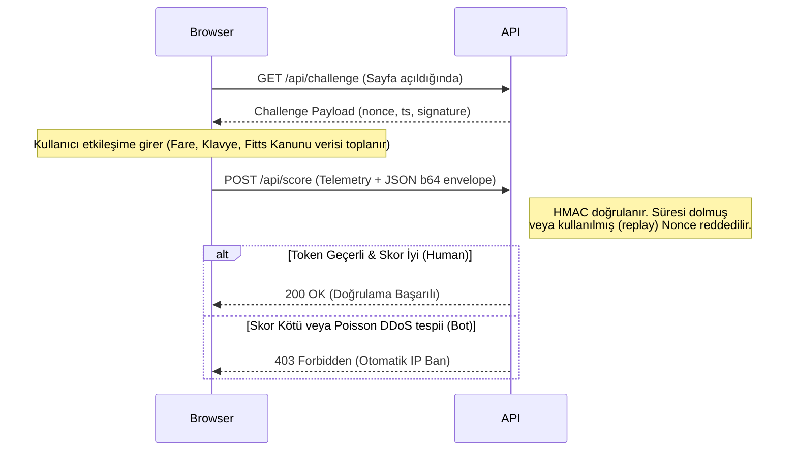

<div align="center">
  <h1>🛡️ Synapse Shield</h1>
  <p><strong>Next-Generation Open-Source Behavioral Biometrics & Bot Mitigation Engine</strong></p>
  
  [](https://www.python.org/)
  [](https://opensource.org/licenses/MIT)
  [](https://github.com/0xStoic-bit/Synapse_Shield/actions)
</div>
<br/>

Synapse Shield, makine öğrenimi tabanlı kinematik özellikleri (Fitts Kanunu, ivme, sarsıntı/jerk) ve Poisson frekans matematiklerini birleştirerek botları **CAPTCHA kullanmadan** anlık olarak tespit eden gelişmiş bir siber güvenlik çözümüdür. Headless tarayıcıları, Selenium botlarını ve Replay Attack mekanizmalarını engeller.

## 🌟 Neden Synapse Shield?

- **Görünmez Bot Koruması**: Klasik kutu işaretleme (Turnstile/reCAPTCHA) eziyetine son verir.
- **Kriptografik Replay Koruması**: İstemci ve sunucu arasında HMAC-SHA256 imzalı tek kullanımlık (nonce) verilerle çalışır.
- **Yüksek Performans & Asenkron Mimari**: FastAPI ve asyncio entegrasyonu sayesinde yüksek trafiklerde (DDoS/Brute-force) bile darboğaz yapmadan çalışır, zararlı IP'leri anında BAN'lar.

---

## 🏗️ Mimari Şema

```mermaid
graph TD
    Client[Web İstemcisi / Browser] --> SDK[Synapse JS SDK]
    SDK -->|Fare/Klavye Telemetrisi| Backend
    Backend[FastAPI Sunucusu] --> Middleware[@shield_protect Middleware]
    Middleware --> Engine[Karar Motoru & Kinetik Extraksiyon]
    Engine -->|Kötü Niyetli| Block[IP Ban & 403 Forbidden]
    Engine -->|Gerçek İnsan| Allow[200 OK - Erişim İzni]

    subgraph Güvenlik Katmanı
        Engine -.-> DB[(SQLite WAL Logs & Banned IPs)]
        Engine -.-> HMAC[Token & Nonce Cache]
    end
```

## 🔄 Token & Replay Attack Akışı (Sequence Diagram)



---

## 🚀 Hızlı Başlangıç (Quickstart)

### 1️⃣ Kurulum

Synapse Shield, bağımlılıkları yüklenerek anında kurulabilir:

```bash
git clone https://github.com/0xStoic-bit/Synapse_Shield.git
cd Synapse_Shield
pip install -r requirements.txt
pip install -e .
```

### 2️⃣ FastAPI ile 3 Satırda Entegrasyon

Synapse Shield, **herhangi bir FastAPI route'unu** tek bir decorator (`@shield_protect`) ile anında koruma altına alabilir:

```python
from fastapi import FastAPI, Request
from synapse_shield.middleware import shield_protect

app = FastAPI()

# 1. Dekoratoryü ekleyin ve maksimum risk skorunu (~50.0) belirleyin
@app.post("/api/login")
@shield_protect(max_risk_score=50.0)
async def login(request: Request):

    # 2. Üst katmanda analiz yapılır; riskli trafik gelirse bu satıra inmeden 403 döndürülür
    return {"message": "Başarıyla giriş yaptınız, siz bir insansınız!"}
```

> **Not:** İstemci tarafında `synapse-sdk.js`'i dahil edip payload'u bu endpointe göndermeniz yeterlidir. Middleware telemetriyi otomatik analiz edecektir.

---

## 📐 Bilimsel Temeller ve Formüller

Synapse Shield, insan davranış modelini doğrulamak için **Fitts Kanunu** (Fitts's Law) ve **Newtonian Jerk (Sarsıntı)** algoritmalarını kullanır.

### Fitts Kanunu ve Asimetrik Yavaşlama

İnsanlar farenin imlecini bir hedefe götürürken başlangıçta ivmelenir (balistik faz), ancak hedefe yaklaştıkça yavaşlayarak düzeltme yaparlar. Botlarda bu ivme genellikle çok doğrusal ve sabit bir profil çizer. Synapse motoru bu profili analiz eder:

```math
\text{Terminal Deceleration Ratio} = \frac{\frac{1}{k} \sum_{i=n-k}^{n} V_i}{V_{max}}
```

> _k: yolculuğun son %25'lik kısmındaki örneklem sayısı._ Oranın `0.85`'ten büyük olması hedefe yaklaşırken hiç yavaşlamayan, muhtemelen bir bota işaret eder.

### Kinetik Sarsıntı (Jerk) Hesabı

Fiziksel kas sistemleri hiçbir zaman tam pürüzsüz hareket üretemez. Hızdaki küçük titremelerin türevi olan sarsıntı (Jerk $\Delta a / \Delta t$) her zaman sıfırdan büyüktür:

```math
\text{Jerk}(t) = \frac{d\vec{a}}{dt} = \frac{\Delta a}{\Delta t}
```

> Mutlak düz çizgiler çıkartan veya sabit hızla mouse kaydıran her Selenium script'i, **sıfır veya sıfıra çok yakın Jerk** gösterdiği için anında bloke edilir.

---

## 📊 Saldırı Vektörleri Benchmark

Sistem toplamda **7 farklı modern saldırı vektörünü** test edecek kapasiteyle optimize edilmiştir.

| Saldırı Tipi                        | Karakteristik Belirti                                                   | Önlem Tipi                            | Bot Skor Etkisi   |
| ----------------------------------- | ----------------------------------------------------------------------- | ------------------------------------- | ----------------- |
| **Doğrusal (Linear) Makro**         | Euclidean olarak kusursuz düz bir çizgi çizer.                          | `Straightness > 0.985` & `Jerk ~ 0`   | `+75.0%` (Kritik) |
| **Selenium Headless Spider**        | `window.navigator.webdriver = true` bırakır, mouse event'leri basittir. | WebDriver API Algılaması              | `+100.0%` (Ban)   |
| **Replay Attack (Yeniden Oynatma)** | Başka bir cihazda alınmış token'ın aynı nonce ile atılması.             | Kriptografik HMAC & Nonce Cache       | `+100.0%` (Ban)   |
| **DDoS / HTTP Flood (Botnet)**      | Saniyede onlarca istek atan, kaba kuvvet uygulaması.                    | Poisson Olasılıksal Dağılımı          | `+60.0%`          |
| **Click Farm / Hidden Form**        | Ekranda mouse olmadan DOM'dan doğrudan `click()` çalıştırılması.        | Mouse noktsı `0` iken Event > 0       | `+50.0%`          |
| **Robotik Ritmik Klavye**           | Milisaniye bazlı mükemmel aralıklarla tuş basımı.                       | `key_interval_var < 4.0 ms`           | `+60.0%`          |
| **İnsanüstü Teleportasyon**         | Max Velocity eşiğinin (`15.0 px/ms`) üstündeki ani atlamalar.           | Hız Limiti Testi (Max Velocity Limit) | `+40.0%`          |

---

## 💻 Önizleme ve Kapsamlı Mod (Dashboard)

Dashboaard, skorlamaları ve IP bloklamalarını canlı izlemek için tam teşekküllü bir FastAPI motoru barındırır. Standart uygulamayı başlatmak için:

```bash
python -m synapse_shield.main
```

Tarayıcınızda açın: `http://localhost:8000/`

## 🛡️ Güvenlik Testleri (Pytest & CI)

Sistemin bütünlüğünü test etmek için özel bir test suite bulunmaktadır. Hem `NaN` gibi hatalı veri injeksiyonlarına hem de Replay/Matematiksel sapmalara karşı test edilmiştir:

```bash
pytest tests/
# VEYA
python tests/test_suite.py
```

## 📜 Lisans

Bu proje **MIT Lisansı** ile lisanslanmıştır. Kullanmakta, modifiye etmekte ve dağıtmakta tamamen özgürsünüz.
